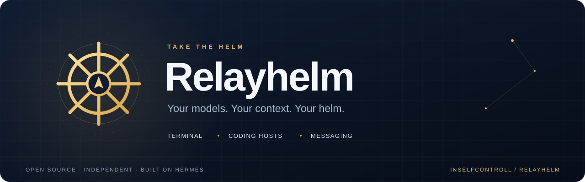

<a id="top"></a>

<p align="center">
  
</p>

<p align="center">
  <strong>An independent agent harness for coding, shared context, and everyday automation.</strong><br>
  Work in your terminal. Connect your coding agents. Continue through your messaging gateway.
</p>

<p align="center">
  <a href="#-quick-start">Quick Start</a> ·
  <a href="#-context-that-stays-useful">Context Broker</a> ·
  <a href="#-your-tools-your-workflow">Integrations</a> ·
  <a href="#-documentation">Documentation</a> ·
  <a href="https://github.com/InSelfControll/relayhelm/issues">Report a Bug</a>
</p>

<p align="center">
  <a href="LICENSE"></a>
  <a href="#-quick-start"></a>
  <a href="https://github.com/InSelfControll/context-broker-mcp"></a>
  <a href="https://github.com/InSelfControll/relayhelm/stargazers"></a>
</p>

---

## 🧭 Take the helm

**Relayhelm brings your models, tools, and project context into one agent workflow.** Built on [Hermes Agent](https://github.com/NousResearch/hermes-agent), it keeps the terminal, desktop, skills, provider adapters, and messaging gateway, then adds an opt-in connection to [Context Broker MCP](https://github.com/InSelfControll/context-broker-mcp).

Share the broker's model and memory pool across sessions. Keep each project's context separate. Bring back relevant issue history when it helps, and ask before splitting work between agents.

<table>
  <tr>
    <td width="50%"><h3>💻 A real working environment</h3>Terminal and browser tools, a TUI, streaming output, slash commands, and a desktop interface inherited from Hermes.</td>
    <td width="50%"><h3>🧠 Context with boundaries</h3>One shared broker pool, separate project histories, and bounded retrieval instead of loading unrelated memory into every new session.</td>
  </tr>
  <tr>
    <td><h3>🤝 Agents on your terms</h3>Choose whether to split a task. Delegated work keeps the selected model, and failures retain their reasons and partial results.</td>
    <td><h3>📬 Beyond the terminal</h3>Connect Telegram, Discord, Slack, Microsoft Teams, and other inherited messaging adapters through the gateway.</td>
  </tr>
  <tr>
    <td><h3>🧩 Extend your workflow</h3>Native Hermes Python plugins plus adapters for supported Claude Code, Codex, and Cursor skills, MCP definitions, and command hooks.</td>
    <td><h3>⏰ Keep useful work running</h3>Reusable skills, scheduled jobs, and platform delivery through the inherited automation system.</td>
  </tr>
</table>

## ⚡ Quick start

### Linux · macOS · WSL2

```bash
curl -fsSL https://raw.githubusercontent.com/InSelfControll/relayhelm/main/scripts/install.sh | bash
```

### Windows · PowerShell

```powershell
irm https://raw.githubusercontent.com/InSelfControll/relayhelm/main/scripts/install.ps1 -OutFile install.ps1
.\install.ps1
```

Then choose your provider and start a conversation:

```bash
relayhelm setup
relayhelm
```

> **Your own installation.** Relayhelm uses `~/.relayhelm` on Linux/macOS and `%LOCALAPPDATA%/relayhelm` on Windows. Its updater points to this repository. Existing Hermes state is not migrated automatically.

<details>
<summary><strong>Install from source / development setup</strong></summary>

```bash
git clone https://github.com/InSelfControll/relayhelm.git
cd relayhelm
uv sync --extra dev --extra mcp
uv run relayhelm setup
uv run relayhelm
```

The source setup above includes development and MCP dependencies. Additional messaging and provider integrations may require their corresponding extras and credentials; see the [installation guide](website/docs/getting-started/installation.md).

</details>

<details>
<summary><strong>Commands and custom installation paths</strong></summary>

| Command | Purpose |
| --- | --- |
| `relayhelm` | Interactive CLI and subcommands |
| `relayhelm-agent` | Direct agent entry point |
| `relayhelm-acp` | ACP entry point for compatible clients |

The Windows installer accepts `-RelayhelmHome`; `-HermesHome` remains accepted for compatibility. Explicit `HERMES_*` overrides and existing Python API identifiers are preserved for extensions. Use separate Relayhelm profiles for separate project bindings.

</details>

## 🧠 Context that stays useful

**Context Broker is the shared service. Relayhelm is one of its clients.** Codex, Claude Code, Cursor, and Hermes can connect to the same broker using their own host configuration.

Install the broker runtime, MCP configuration, usage skill, and plugin for a project:

```bash
relayhelm context-broker install --project-root /absolute/project
```

The agent starts the shared broker automatically on its first MCP connection. Update it with:

```bash
relayhelm context-broker update --check
relayhelm context-broker update
```

Restart your agent after installation. See **[Relayhelm integration setup →](docs/context-broker-integration.md)** for profiles and other coding hosts.

| What matters | How it works |
| --- | --- |
| **One shared pool** | The broker owns the shared model and memory pool; the Relayhelm plugin does not load another embedding model. |
| **Separate project context** | Explicit project roots scope history and handoffs. |
| **Relevant history only** | Each text-bearing prompt gets a bounded lookup. No matching history means no added history context. |
| **Your indexing choice** | `/context-broker index` asks **Index / No index**. Both choices continue reading original history. |
| **Explicit model handoffs** | Save and load checkpoints with messages, constraints, decisions, task states, and file freshness checks. |
| **A working off switch** | Disabling a required MCP disables its dependent plugin and closes that transport while preserving unrelated servers. |

### Split big tasks—with your say-so

Relayhelm asks before starting delegated work. You can keep one agent or split the task between agents using the selected model.

**A partial result is not a completed task.** Provider errors, timeouts, and exhausted budgets remain failed with a reason. Broker proposals still need integration and verification before completion.

[Read the delegation contract →](docs/native-delegation.md)

## 🔌 Your tools, your workflow

| Surface | Connection |
| --- | --- |
| **Codex · Claude Code · Cursor · Hermes** | Connect directly to Context Broker using its host configuration generator. |
| **Claude Code · Codex · Cursor plugin packages** | Load supported skills, MCP definitions, and command hooks through Relayhelm's package adapters. |
| **Native Hermes Python plugins** | Continue using the existing `register(ctx)` APIs. |
| **Telegram · Discord · Slack · Microsoft Teams** | Configure credentials and enable the corresponding messaging gateway adapter. |
| **Model providers** | Choose from the inherited provider adapters and supported compatible endpoints. |

**[Plugin compatibility matrix →](docs/plugin-compatibility.md)** · **[Provider guide →](website/docs/integrations/providers.md)**

<details>
<summary><strong>Compatibility and validation status</strong></summary>

Plugin packages must be explicitly enabled. Some host-specific components—such as native LSP, apps, and unsupported hook types—require their original host. Relayhelm reports unsupported components rather than silently dropping them.

The integration work passed **548 Python tests and 152 selected Node checks**, with seven platform-specific skips. Full Windows/Electron builds and every third-party native plugin have not been validated. Provider authentication and messaging delivery require testing with your configured services.

</details>

## 📚 Documentation

| Start here | Go deeper |
| --- | --- |
| [Installation](website/docs/getting-started/installation.md) | [Context Broker integration](docs/context-broker-integration.md) |
| [CLI guide](website/docs/user-guide/cli.md) | [Plugin compatibility](docs/plugin-compatibility.md) |
| [Configuration](website/docs/user-guide/configuration.md) | [Delegation and failure reporting](docs/native-delegation.md) |
| [Skills](website/docs/user-guide/features/skills.md) | [Scheduled jobs](website/docs/user-guide/features/cron.md) |
| [Model providers](website/docs/integrations/providers.md) | [Project separation and attribution](UPSTREAM.md) |

### Build with us

Found a bug or have an integration to improve? [Open an issue](https://github.com/InSelfControll/relayhelm/issues) or contribute here in Relayhelm.

```bash
scripts/run_tests.sh -j 4
```

Use the repository test runner for isolated state and credentials. Read [AGENTS.md](AGENTS.md) before contributing.

---

<p align="center">
  <strong>Independent direction. Open-source roots.</strong><br>
  Built from <a href="https://github.com/NousResearch/hermes-agent">Hermes Agent</a> by Nous Research and its contributors.<br>
  Maintained independently by <a href="https://github.com/InSelfControll">InSelfControll</a> · <a href="LICENSE">MIT licensed</a> · <a href="UPSTREAM.md">Upstream attribution</a>
</p>

<p align="center">
  <a href="#top">↑ Back to top</a>
</p>
